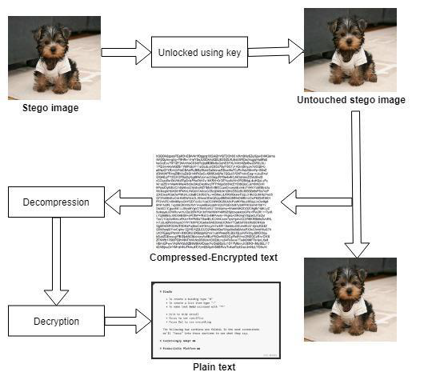
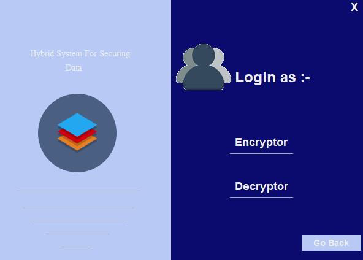
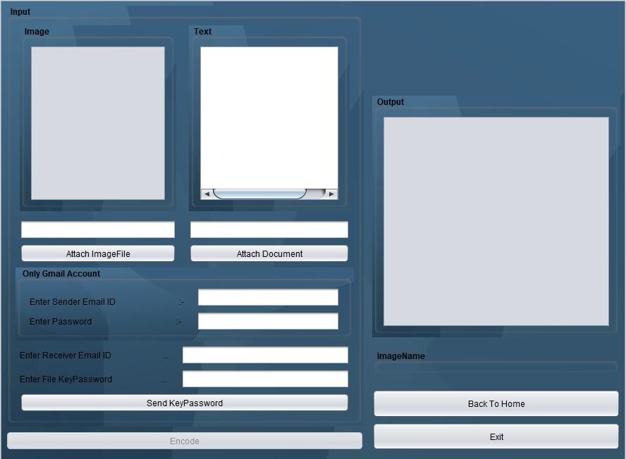
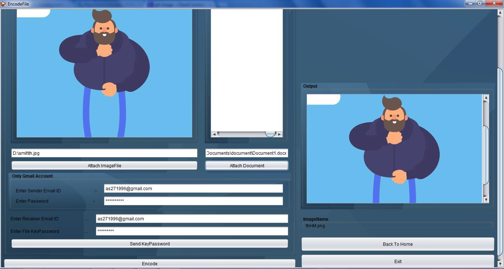
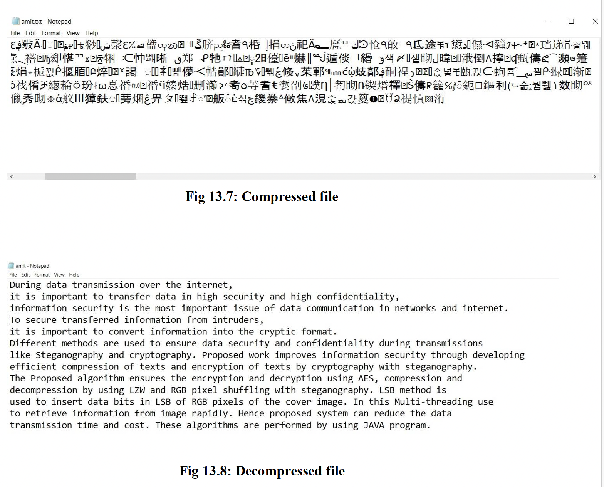
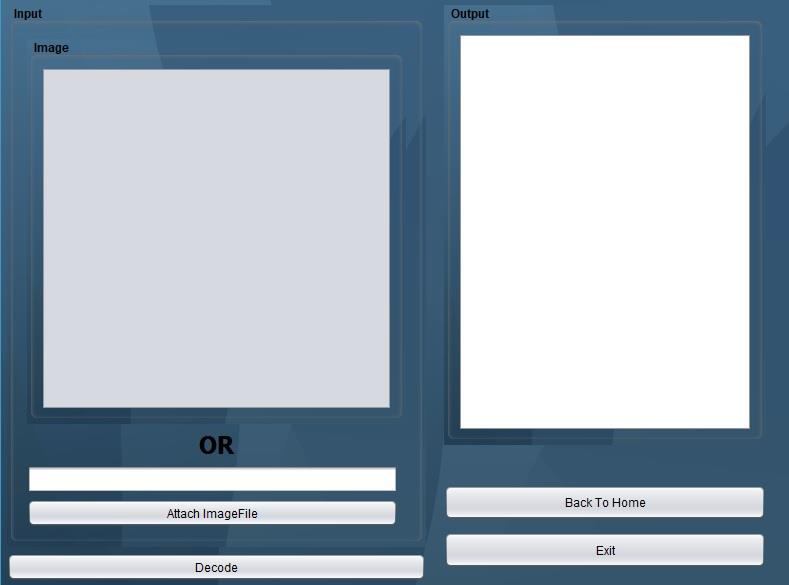
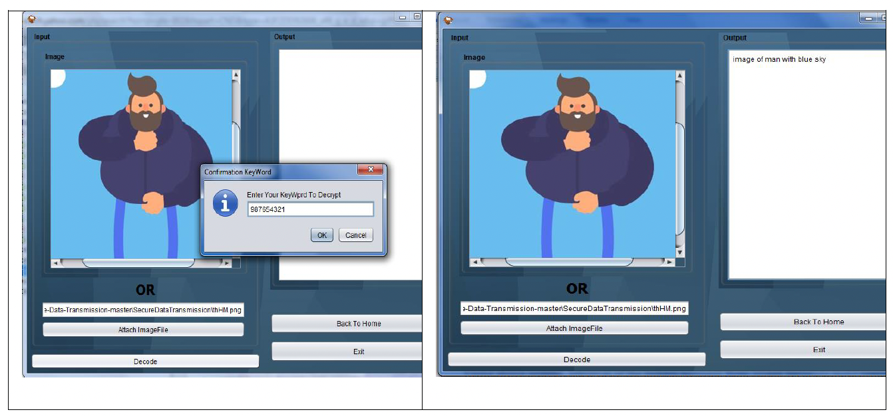

# Hybrid Approach for Securing Data

A Java-based desktop application developed as a final-year engineering project to explore secure data transmission using a combination of **cryptography, lossless compression, image steganography, and multithreaded extraction**.

The system applies multiple layers to protect text data:

1. Encrypts the original text using **AES**
2. Compresses the encrypted data using **LZW lossless compression**
3. Embeds the compressed data inside a cover image using **Least Significant Bit (LSB) steganography**
4. Protects the extraction process using a secret key
5. Reverses the process at the receiver side through extraction, decompression, and decryption

The project was designed to improve confidentiality while also reducing the amount of data that needs to be embedded inside the carrier image through compression.

## System Architecture

The overall workflow combines cryptography, compression, and steganography into a single data-protection pipeline.


### High-Level Flow

```text
Plain Text
    ↓
AES Encryption
    ↓
LZW Compression
    ↓
LSB Image Steganography
    ↓
Stego Image
    ↓
Secure Transmission
    ↓
LSB Extraction
    ↓
LZW Decompression
    ↓
AES Decryption
    ↓
Original Text
```

## Key Features

- **Multi-layer data protection** using AES encryption, LZW compression, and LSB image steganography
- **Secure text embedding** inside cover images while keeping the visual appearance of the image largely unchanged
- **Lossless compression** using LZW before embedding to reduce the size of the hidden data
- **Secret-key based extraction** to restrict access to hidden information
- **Separate encryptor and decryptor workflows** for sender and receiver operations
- **User authentication** through registration and login interfaces
- **Image-based embedding and extraction** through a Java desktop interface
- **Multithreaded extraction approach** designed to reduce decoding time
- **Key sharing workflow** for transferring the extraction key to the receiver
- **Compression and decompression utilities** integrated into the application workflow

## Detailed Workflow

### Embedding Process

The sender-side workflow applies multiple layers of protection before storing the data inside the cover image:

1. Read the original text message
2. Encrypt the message using AES
3. Compress the encrypted text using LZW lossless compression
4. Convert the compressed data into a bit stream
5. Embed the bit stream into the image using LSB steganography
6. Generate the stego image and protect the extraction process using a secret key


### Extraction Process

The receiver performs the reverse workflow:

1. Load the stego image
2. Provide the required secret key
3. Extract the hidden bit stream using the reverse LSB process
4. Reconstruct the compressed data
5. Decompress the data using LZW
6. Decrypt the recovered text using AES
7. Restore the original message



## Tech Stack

**Language:** Java  
**Desktop UI:** Java Swing  
**Encryption:** AES (`javax.crypto`)  
**Compression:** LZW  
**Steganography:** Least Significant Bit (LSB) image steganography  
**Image Processing:** BufferedImage, ImageIO  
**Networking:** Java Sockets  
**Email Integration:** JavaMail API  
**Build Tool / IDE:** Ant, NetBeans

## Application Screenshots

### Registration


### Login



### Encryptor Dashboard



### Embedding Data



### LZW Compression


### Compression / Decompression Result



### Decryptor Dashboard



### Extracting Hidden Data



## Project Structure

```text
SecureDataTransmission/
├── src/
│   ├── MyPackage/
│   │   ├── AESCrypt.java
│   │   ├── MessageHideSeek.java
│   │   ├── EncodeText.java
│   │   ├── EncodeFile.java
│   │   ├── DecodeImage.java
│   │   ├── DecodeTextFile.java
│   │   ├── EmailidSender.java
│   │   ├── Steganography.java
│   │   ├── About.java
│   │   └── Help.java
│   │
│   └── com/
│       ├── socket/
│       │   ├── SocketClient.java
│       │   ├── Upload.java
│       │   ├── Download.java
│       │   ├── Message.java
│       │   └── History.java
│       │
│       └── ui/
│           ├── ChatFrame.java
│           └── HistoryFrame.java
│
├── dist/
│   └── SecureDataTransmission.jar
│
├── nbproject/
├── build.xml
└── manifest.mf
```

## Main Modules

### Encryption
`AESCrypt.java` handles the AES-based encryption and decryption logic used to protect the original data before it is embedded.

### Steganography
`MessageHideSeek.java` and the related encode/decode classes handle hiding and extracting data from image files.

### Encoding & Decoding
The project separates sender and receiver operations through dedicated classes for:
- encoding text
- encoding files
- decoding images
- decoding extracted text/files

### Communication
The `com.socket` package contains socket-based communication components for uploading, downloading, messaging, and maintaining transfer history.

### User Interface
The application uses Java Swing forms for the main steganography workflow, chat interface, history view, help, and project information.

## Running the Application

### Prerequisites

Make sure the following are installed:

- Java 8 or later
- NetBeans IDE or another Java IDE with Ant support
- Ant
- JavaMail dependency (`javax.mail-1.5.0.jar`)

### 1. Clone the Repository

```bash
git clone https://github.com/as271996/Secure-Data-Transmission.git
cd Secure-Data-Transmission/SecureDataTransmission
```

### 2. Open the Project

Open the `SecureDataTransmission` folder in NetBeans.

The configured main class is:

```text
MyPackage.Steganography
```

### 3. Configure JavaMail

The original project references the JavaMail library from a local machine path.

Update the JavaMail dependency in NetBeans so that the project points to a valid local copy of:

```text
javax.mail-1.5.0.jar
```

### 4. Build the Project

Using NetBeans, select:

```text
Run → Clean and Build Project
```

Or build using Ant from the project directory:

```bash
ant clean
ant jar
```

### 5. Run the Application

From NetBeans, run the project normally.

Alternatively, after a successful build, navigate to the `dist` directory:

```bash
cd dist
```

and run:

```bash
java -jar SecureDataTransmission.jar
```

The Java Swing application will launch and allow you to use the registration/login, encryption, compression, steganography, and extraction workflows.

## Project Background

This project was developed as a **final-year Computer Engineering project (2017–2018)** at Atharva College of Engineering, University of Mumbai.

The objective was to explore a hybrid approach for securing data during transmission by combining multiple techniques instead of relying on a single security mechanism.

The proposed workflow combines:

- **AES encryption** for protecting the original message
- **LZW lossless compression** for reducing the size of the encrypted data before embedding
- **LSB image steganography** for hiding the protected data inside an image
- **Secret-key based extraction** for restricting access to the hidden information
- **Multithreaded extraction** to improve the decoding process

The project evolved from an earlier standalone image-steganography implementation into a more complete secure-data-transmission application with authentication, encryption/decryption, compression/decompression, steganography, communication, and sender/receiver workflows.

## Results and Demonstration

The completed application demonstrated an end-to-end secure-data workflow combining encryption, compression, steganography, and controlled extraction.

The project documentation records successful testing of:

- AES-based encryption and decryption using a secret key
- LZW compression and decompression
- LSB-based data embedding and extraction
- Multithreaded extraction from stego images
- Secret-key delivery to the receiver through email
- User authentication for encryptor and decryptor workflows
- Sender-side embedding and receiver-side extraction through the desktop interface

The project also evaluated the visual similarity between the original cover image and the generated stego image using image-quality concepts such as PSNR and MSE.

The use of LZW compression before embedding was intended to reduce the amount of data stored inside the carrier image and improve effective hiding capacity, while the multithreaded extraction approach was introduced to reduce decoding time.

## Limitations and Future Improvements

This project was developed as an academic prototype and can be improved further in several areas:

- Upgrade the application to a modern Java version and a newer build setup
- Replace the NetBeans/Ant-specific project structure with Maven or Gradle
- Improve credential and key management
- Add stronger role-based access control
- Replace older JavaMail and local dependency configuration with managed dependencies
- Improve exception handling and validation across file-processing workflows
- Add automated unit and integration tests
- Add file-capacity validation before embedding data into a carrier image
- Improve the Swing-based user interface and overall user experience
- Add support for additional carrier and hidden-file formats
- Benchmark the multithreaded extraction approach with different file sizes and thread counts
- Add automated PSNR/MSE measurements for comparing cover and stego images
- Package the application for easier cross-platform execution

## Author

**Amit Singh**

Final-year Computer Engineering project developed at Atharva College of Engineering, University of Mumbai.

- GitHub: [github.com/as271996](https://github.com/as271996)
- LinkedIn: [linkedin.com/in/amit-singh-sp27](https://www.linkedin.com/in/amit-singh-sp27)

## Related Project

This application builds on the image-steganography technique developed separately in:

[Image Steganography - Java](https://github.com/as271996/image-steganography-java)

That project focuses on the core LSB-based image-steganography mechanism, while this project extends the concept into a broader secure-data-transmission workflow using encryption, compression, authentication, and sender/receiver flows.

## Documentation

The original academic documentation for this final-year project is available below:

- [Project Report](./docs/hybrid-approach-project-report.pdf)
- [Technical Paper — Hybrid Approach for Securing Data](./docs/hybrid-approach-technical-paper.pdf)

These documents cover the project motivation, proposed architecture, AES encryption, LZW compression, LSB image steganography, multithreaded extraction, system design, testing, and result analysis.
