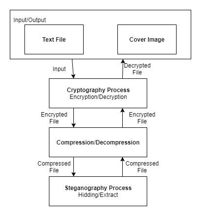

# Hybrid Approach for Securing Data

A Java-based desktop application developed as a final-year engineering project to explore secure data transmission using a combination of **cryptography, lossless compression, image steganography, and multithreaded extraction**.

The system applies multiple layers to protect text data:

1. Encrypts the original text using **AES**
2. Compresses the encrypted data using **LZW lossless compression**
3. Embeds the compressed data inside a cover image using **Least Significant Bit (LSB) steganography**
4. Protects the extraction process using a secret key
5. Reverses the process at the receiver side through extraction, decompression, and decryption

The project was designed to improve confidentiality while also reducing the amount of data that needs to be embedded inside the carrier image through compression.

## System Architecture

The overall workflow combines cryptography, compression, and steganography into a single data-protection pipeline.



### High-Level Flow

```text
Plain Text
    ↓
AES Encryption
    ↓
LZW Compression
    ↓
LSB Image Steganography
    ↓
Stego Image
    ↓
Secure Transmission
    ↓
LSB Extraction
    ↓
LZW Decompression
    ↓
AES Decryption
    ↓
Original Text
```

## Key Features

- **Multi-layer data protection** using AES encryption, LZW compression, and LSB image steganography
- **Secure text embedding** inside cover images while keeping the visual appearance of the image largely unchanged
- **Lossless compression** using LZW before embedding to reduce the size of the hidden data
- **Secret-key based extraction** to restrict access to hidden information
- **Separate encryptor and decryptor workflows** for sender and receiver operations
- **User authentication** through registration and login interfaces
- **Image-based embedding and extraction** through a Java desktop interface
- **Multithreaded extraction approach** designed to reduce decoding time
- **Key sharing workflow** for transferring the extraction key to the receiver
- **Compression and decompression utilities** integrated into the application workflow
