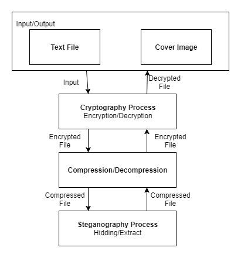
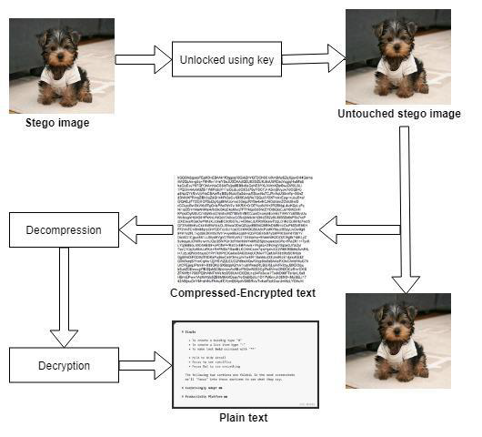
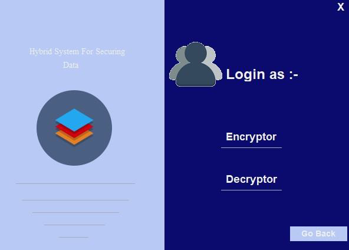
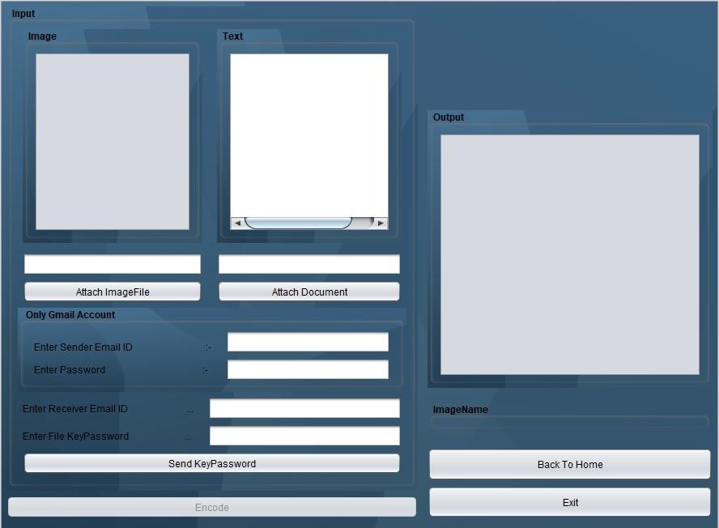
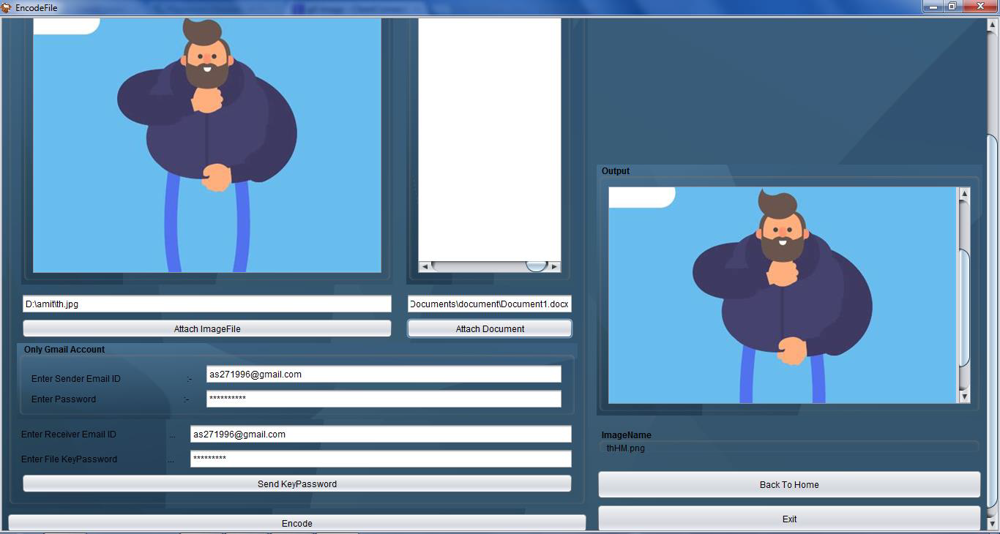
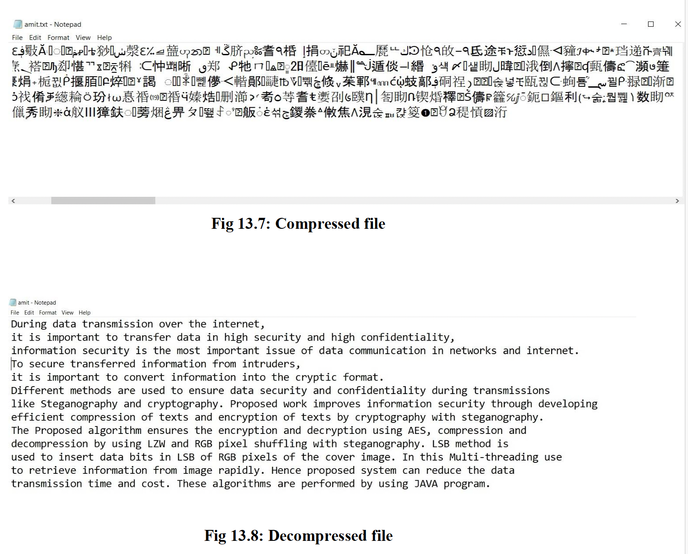
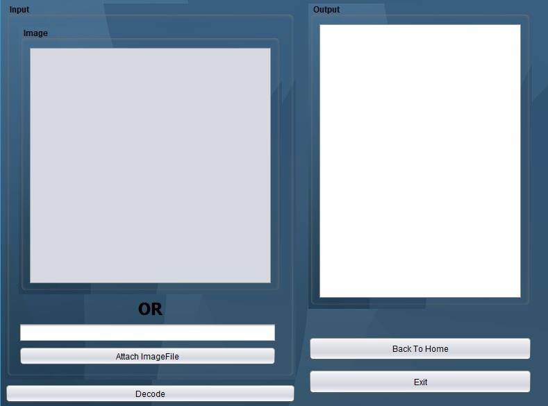
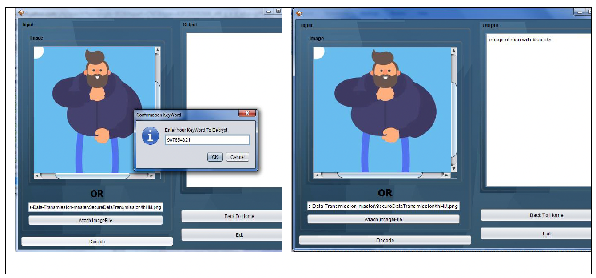

# Hybrid Approach for Securing Data

A Java desktop application developed as a **final-year Computer Engineering project** to explore a hybrid approach to data protection using **AES encryption, LZW lossless compression, LSB image steganography, and multithreaded extraction**.

The application combines multiple techniques into a single sender-to-receiver workflow:

1. Encrypt the original text using **AES**
2. Compress the encrypted data using **LZW**
3. Hide the compressed data inside an image using **Least Significant Bit (LSB) steganography**
4. Protect the extraction process using a secret key
5. Extract, decompress, and decrypt the data at the receiver side

The project was designed to explore how cryptography, compression, and steganography can be combined instead of relying on a single data-protection technique.

---

## Key Features

- AES-based text encryption and decryption
- LZW lossless compression and decompression
- LSB image steganography
- Secret-key based extraction workflow
- Separate sender/encryptor and receiver/decryptor flows
- User registration and authentication
- Image-based data embedding and extraction
- Multithreaded extraction
- Java Swing desktop interface
- Socket-based communication components
- JavaMail-based key sharing workflow
- Image-quality analysis concepts using PSNR and MSE

---

## System Architecture

The application combines cryptography, compression, and steganography into a single processing pipeline.



### High-Level Flow

```text
Plain Text
    │
    ▼
AES Encryption
    │
    ▼
LZW Compression
    │
    ▼
LSB Image Steganography
    │
    ▼
Stego Image
    │
    ▼
Transmission / Sharing
    │
    ▼
LSB Extraction
    │
    ▼
LZW Decompression
    │
    ▼
AES Decryption
    │
    ▼
Original Text
```

---

## How It Works

### Sender / Embedding Process

The sender-side workflow prepares the message before embedding it into a cover image.

1. Read the original text message
2. Encrypt the message using AES
3. Compress the encrypted data using LZW
4. Convert the compressed data into a bit stream
5. Embed the bit stream into the image using LSB steganography
6. Generate the stego image
7. Protect the extraction workflow using a secret key


### Receiver / Extraction Process

The receiver performs the reverse process.

1. Load the stego image
2. Provide the required secret key
3. Extract the hidden bit stream using the reverse LSB process
4. Reconstruct the compressed data
5. Decompress the data using LZW
6. Decrypt the recovered data using AES
7. Restore the original text



---

## Why Combine Encryption, Compression, and Steganography?

The project explores three different concepts that serve different purposes.

### Encryption

AES protects the **contents of the message** by transforming readable plaintext into encrypted data.

```text
Plain Text
    ↓
AES
    ↓
Encrypted Data
```

### Compression

LZW reduces the amount of data that needs to be embedded inside the carrier image.

```text
Encrypted Data
    ↓
LZW
    ↓
Compressed Data
```

### Steganography

LSB steganography attempts to **hide the existence of the protected data** by embedding it inside an image.

```text
Compressed Data
    ↓
LSB Embedding
    ↓
Stego Image
```

Together, the project demonstrates a layered data-protection pipeline rather than relying on only one technique.

---

## Security Note

Steganography and encryption solve different problems.

- **Encryption** protects the contents of data even if the encrypted data is discovered.
- **Steganography** attempts to conceal the existence of the data itself.
- **Compression** reduces the size of the data but does not provide security.

This project combines these techniques as an academic prototype.

The security of a real production system would additionally depend on factors such as secure key management, authenticated encryption, secure password handling, transport security, integrity verification, and protection of cryptographic secrets.

---

## Tech Stack

| Area | Technology |
|---|---|
| Language | Java |
| Desktop UI | Java Swing |
| Encryption | AES using `javax.crypto` |
| Compression | LZW |
| Steganography | Least Significant Bit (LSB) |
| Image Processing | `BufferedImage`, `ImageIO` |
| Networking | Java Sockets |
| Email Integration | JavaMail API |
| Build Tool | Ant |
| Original IDE | NetBeans |

---

## Application Screenshots

### Registration


### Login



### Encryptor Dashboard



### Embedding Data



### LZW Compression


### Compression / Decompression Result



### Decryptor Dashboard



### Extracting Hidden Data



---

## Project Structure

```text
SecureDataTransmission/
├── src/
│   ├── MyPackage/
│   │   ├── AESCrypt.java
│   │   ├── MessageHideSeek.java
│   │   ├── EncodeText.java
│   │   ├── EncodeFile.java
│   │   ├── DecodeImage.java
│   │   ├── DecodeTextFile.java
│   │   ├── EmailidSender.java
│   │   ├── Steganography.java
│   │   ├── About.java
│   │   └── Help.java
│   │
│   └── com/
│       ├── socket/
│       │   ├── SocketClient.java
│       │   ├── Upload.java
│       │   ├── Download.java
│       │   ├── Message.java
│       │   └── History.java
│       │
│       └── ui/
│           ├── ChatFrame.java
│           └── HistoryFrame.java
│
├── dist/
│   └── SecureDataTransmission.jar
│
├── nbproject/
├── build.xml
└── manifest.mf
```

---

## Main Modules

### AES Encryption

`AESCrypt.java` contains the AES-based encryption and decryption logic used to protect the original message.

### Steganography

`MessageHideSeek.java` and the related encoding/decoding classes implement the image-steganography workflow.

The steganography layer embeds protected data into image content using the Least Significant Bit technique.

### Encoding and Decoding

The application separates sender-side and receiver-side processing through dedicated classes for:

- text encoding
- file encoding
- image decoding
- extracted text/file decoding

### Compression

LZW compression is used before steganographic embedding to reduce the amount of data that needs to be stored inside the carrier image.

The reverse LZW process reconstructs the original encrypted data before AES decryption.

### Communication

The `com.socket` package contains components for:

- socket communication
- uploads
- downloads
- messaging
- transfer history

### Email Integration

The application uses the JavaMail API as part of the key-sharing workflow between sender and receiver.

### User Interface

Java Swing is used for:

- registration
- login
- sender/encryptor workflow
- receiver/decryptor workflow
- image selection
- message processing
- chat
- transfer history
- help and project information

---

## Multithreaded Extraction

The project includes a multithreaded extraction approach designed to improve the decoding process.

Instead of treating extraction as a purely sequential operation, the implementation explores processing work concurrently to reduce extraction time.

The original project also evaluated this approach as part of its academic analysis.

A more rigorous modern implementation could benchmark:

- sequential extraction
- different thread counts
- different image sizes
- different message sizes
- CPU utilization
- extraction latency
- thread-management overhead

---

## Image Quality Evaluation

The project also considered image-quality concepts such as:

- **MSE — Mean Squared Error**
- **PSNR — Peak Signal-to-Noise Ratio**

These metrics can be used to compare the original cover image with the generated stego image.

The goal of LSB steganography is to modify image data while keeping the visible difference between the original and generated image difficult to notice under normal viewing conditions.

---

## Running the Application

### Prerequisites

Make sure the following are installed:

- Java 8 or later
- Ant
- NetBeans IDE or another Java IDE with Ant support
- JavaMail dependency (`javax.mail-1.5.0.jar`)

---

### 1. Clone the Repository

```bash
git clone https://github.com/as271996/secure-data-transmission.git
cd secure-data-transmission/SecureDataTransmission
```

---

### 2. Open the Project

Open the following directory in NetBeans:

```text
SecureDataTransmission
```

The configured main class is:

```text
MyPackage.Steganography
```

---

### 3. Configure JavaMail

The original project references the JavaMail dependency through a local machine configuration.

Update the project dependency so that NetBeans points to a valid copy of:

```text
javax.mail-1.5.0.jar
```

A future version of the project should move this dependency into Maven or Gradle instead of relying on a local JAR path.

---

### 4. Build the Project

Using NetBeans:

```text
Run → Clean and Build Project
```

Or build with Ant:

```bash
ant clean
ant jar
```

---

### 5. Run the Application

Run the project from NetBeans.

Alternatively, after a successful build:

```bash
cd dist
java -jar SecureDataTransmission.jar
```

The Java Swing application will launch and provide access to the registration, login, encryption, compression, steganography, and extraction workflows.

---

## Project Background

This project was developed as a **final-year Computer Engineering project (2017–2018)** at Atharva College of Engineering, University of Mumbai.

The objective was to explore a hybrid approach to protecting data during transmission by combining several techniques rather than relying on a single mechanism.

The proposed workflow combines:

- **AES encryption** for protecting message contents
- **LZW lossless compression** for reducing the amount of data before embedding
- **LSB image steganography** for hiding protected data inside an image
- **Secret-key based extraction** for controlling access to the hidden information
- **Multithreaded extraction** for exploring improvements to decoding performance

The project evolved from an earlier standalone image-steganography implementation into a broader application containing encryption/decryption, compression/decompression, authentication, communication, steganography, and sender/receiver workflows.

---

## Results and Demonstration

The completed prototype demonstrated an end-to-end workflow combining encryption, compression, steganography, and controlled extraction.

The original project documentation records successful testing of:

- AES-based encryption and decryption
- LZW compression and decompression
- LSB-based data embedding and extraction
- Multithreaded extraction from stego images
- Secret-key delivery through email
- User authentication
- Sender-side embedding
- Receiver-side extraction
- Image-quality comparison using PSNR and MSE concepts

LZW compression was introduced before embedding to reduce the amount of data stored inside the carrier image.

The multithreaded extraction approach was introduced to explore reduced decoding time.

---

## Engineering Concepts Demonstrated

Although this is an academic project, it demonstrates several useful software-engineering concepts:

- Java object-oriented programming
- Java Swing desktop application development
- File and image processing
- Cryptographic API usage
- Lossless compression
- Bit-level data manipulation
- Image steganography
- Java socket programming
- Multithreading
- Sender/receiver workflow design
- Modular encoding and decoding
- External-library integration
- Build automation using Ant

---

## Limitations and Future Improvements

This project was developed as an academic prototype rather than a production security system.

### Security

- Use modern authenticated encryption instead of relying only on basic encryption
- Improve cryptographic key generation and key management
- Avoid exposing or transmitting sensitive keys through insecure channels
- Securely hash user passwords instead of storing raw credentials
- Add stronger authentication and role-based authorization
- Add integrity verification for extracted messages
- Encrypt network communication using TLS
- Review the implementation against modern cryptographic best practices

### Steganography

- Validate image capacity before attempting to embed data
- Support additional lossless carrier-image formats
- Support hiding arbitrary binary files in addition to text
- Add stronger validation when decoding malformed or unsupported images
- Explore pseudo-random embedding positions instead of always using predictable bit locations
- Compare different embedding strategies and their impact on image quality
- Automatically calculate PSNR and MSE after embedding

### Performance

- Benchmark sequential vs multithreaded extraction
- Test different image and payload sizes
- Measure performance with different thread counts
- Measure CPU and memory utilization
- Avoid creating unnecessary threads for workloads where concurrency provides no benefit

### Architecture

- Separate UI, cryptography, compression, steganography, and communication concerns into clearer modules
- Introduce interfaces for encoding, decoding, encryption, and compression strategies
- Improve exception handling and validation
- Externalize application configuration
- Reduce coupling between Swing forms and core processing logic
- Add structured logging

### Testing

- Add unit tests for AES encryption/decryption wrappers
- Add unit tests for LZW compression/decompression
- Add encoding/decoding tests for LSB steganography
- Verify round-trip integrity:

```text
Original Data
    ↓
Encrypt
    ↓
Compress
    ↓
Embed
    ↓
Extract
    ↓
Decompress
    ↓
Decrypt
    ↓
Original Data
```

- Add boundary tests for image capacity
- Add tests for invalid keys
- Add corrupted-image tests
- Add integration tests covering complete sender-to-receiver workflows

### Build and Deployment

- Upgrade to a modern Java LTS version such as Java 21
- Replace Ant/NetBeans-specific configuration with Maven or Gradle
- Manage JavaMail and other dependencies through the build system
- Add GitHub Actions for automated builds and tests
- Package the desktop application for easier cross-platform execution
- Add environment-specific configuration where required

### User Experience

- Modernize the Swing interface
- Improve validation and error messages
- Display image capacity before embedding
- Display message/file size information
- Add progress indicators for compression, embedding, and extraction
- Improve key-management workflows
- Add drag-and-drop file selection

---

## Related Project

This application builds on the standalone image-steganography project:

[Image Steganography - Java](https://github.com/as271996/image-steganography-java)

The standalone project focuses specifically on the core LSB image-steganography technique.

This project extends that idea into a broader workflow combining:

```text
Encryption
    +
Compression
    +
Steganography
    +
Authentication
    +
Communication
```

---

## Documentation

The original academic documentation is available in the repository:

- [Project Report](./docs/hybrid-approach-project-report.pdf)
- [Technical Paper — Hybrid Approach for Securing Data](./docs/hybrid-approach-technical-paper.pdf)

The documents cover:

- project motivation
- system architecture
- AES encryption
- LZW compression
- LSB image steganography
- multithreaded extraction
- system design
- testing
- PSNR/MSE analysis
- project results

---

## Author

**Amit Singh**

Final-year Computer Engineering project developed at Atharva College of Engineering, University of Mumbai.

- GitHub: [github.com/as271996](https://github.com/as271996)
- LinkedIn: [linkedin.com/in/amit-singh-sp27](https://www.linkedin.com/in/amit-singh-sp27)

---

Built as an academic exploration of combining cryptography, compression, image steganography, networking, and concurrent processing in a Java desktop application.
